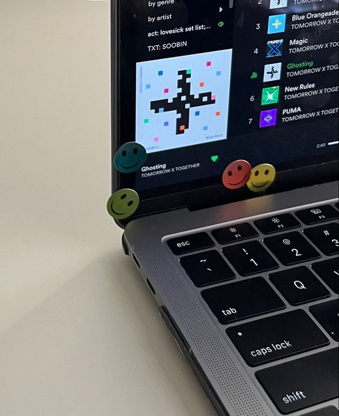

  

    <h2 style="font-size: 26px; font-weight: bold; margin-bottom: 20px;">안녕하세요! 🫡</h2>
    

      저는 데이터 엔지니어를 꿈꾸는 <strong>장민수</strong>입니다. 
      효율적이고 견고한 데이터 파이프라인을 구축하고,  
      <strong>데이터로 가치를 창출하는 일</strong>에 열정을 가지고 있습니다.
    

    

      💬 데이터 엔지니어링, 분석, 또는 최신 기술 트렌드에 대한 대화를 항상 환영합니다!
    

    

      <a href="https://www.notion.so/f25ef223059c4d15950bf50373d6173a" style="font-size: 20px; color: #0073e6; text-decoration: none; border: 2px solid #0073e6; padding: 12px 24px; border-radius: 4px;">
        📄 포트폴리오
      </a>
    

    

      <em>Photo by</em> <a href="https://kr.pinterest.com/pin/6473993210314985/" style="color: #0073e6; text-decoration: none;">savannah</a> <em>on Pinterest</em>
    

  

  

    
  

  

